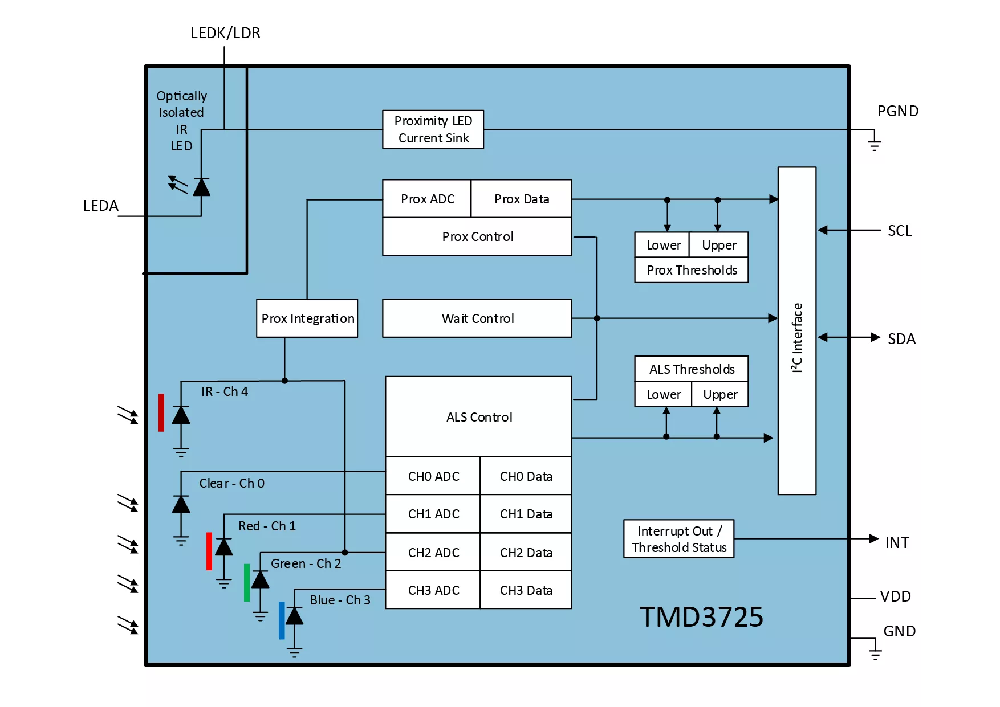

# TMD3725 Arduino library

Arduino library for TMD37253 and TMD37253M RGB color sensor with proximity and ambient light functions

[TM3725 datasheet](https://look.ams-osram.com/m/6a4d0816b7d3a4bf/original/TMD3725-ALS-Color-and-Proximity-Sensor-Module.pdf)



## Functions
```cpp
// check if TMD3725 present on 0x39 I2C address
bool connected(); 

// Set integration time
int set_atime(int reginfo[], int cycle_No); 

// set the gain and IR to GREEN settings
int set_cfg1(int reginfo[], int IRtoG_flag, int again_flag); 

// Enable wait, prox, als features
int enable_sensor(int reginfo[], int wait_flag, int prox_flag, int als_flag); 

// Initialize the sensor
int init(int reginfo[]); 

// get all 35 sensor registers data
int get_all_data(int reginfo[]); 

 // get only 9 color registers data
int get_optics_data(int color_array[]);

 // convert color array pairs to 2 byte color data
int combine_color(const int color_array[], int flag);

// caliberate color data with IR channel
optics_val calib_color(const int colorarray[], const int reginfo[]); 

 // get data from the sensor and calibrate it
optics_val get_calib_color(const int reginfo[]);

 // power math function
float power(float base, int power);

// convert rgb color structure to hsv color format
hsv rgb2hsv(rgb in); 

// convert hsv color structure to rgb color format
rgb hsv2rgb(hsv in); 

// get color data from the sensor and print it to stdout in rgb and hsv formats
void print_color(optics_val color_data);    

 // get color data from the sensor and print it to stdout in json format
void print_color_json(optics_val color_data, uint32_t timestamp);
```

## Examples

TMD3725_basic.ino - basic color reading in a loop example
TCA9544_TMD3725.ino - addressable example for several color sensors with TCA9544A multiplexor (cause TMD3725 does not have address setting feature)

## Serial monitor output
```
{"timestamp":"477573","hue":"60","saturation":"1","value":"0",}
REG[35]: 07 00 1F 00 00 00 00 00 00 00 00 80 4F 80 01 00 E4 30 01 00 01 00 01 00 00 00 04 04 0C 00 00 00 50 00 00 
CLR   RED   GRN   BLU   PRX 
01 00 01 00 01 00 00 00 05 
|CLEAR   |RED     |GREEN   |BLUE    |LUX     |CCT     |
|1       |1       |1       |0       |17      |1804    |
|HUE     |SAT     |VUE      |
|60      |1       |0       |
```

## Tested on devices

* [Arduino Nano - ATmega328P](https://docs.arduino.cc/hardware/nano/)
* [Raspberry Pi Pico - RP2040](https://www.raspberrypi.com/products/raspberry-pi-pico/)