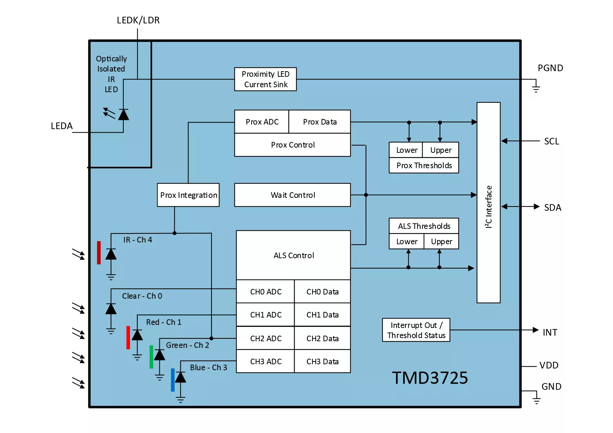

# TMD3725 Arduino library

Arduino library for TMD3725 and TMD3725M RGB color sensors with proximity and ambient light functions.

[TM3725 datasheet](https://look.ams-osram.com/m/6a4d0816b7d3a4bf/original/TMD3725-ALS-Color-and-Proximity-Sensor-Module.pdf)



## Functions

The library supports:

* sensor initialization and configuration
* full register data reading
* color data reading
* RGB to HSV conversion and HSV to RGB conversion
* hue and brightness value helpers
* JSON color data output

Color helper functions:

* `print_color()` returns the detected hue value.
* `return_Brightness()` returns the brightness/value component.
* `return_Brigtness()` is kept as a backward-compatible alias for the misspelled 0.3.0 API.
* `print_color_json()` prints color data as JSON and returns the detected hue value.

See [TMD3725](src/TMD3725.h) code comments for detailed function descriptions.

## Examples

* TMD3725_basic.ino - basic color reading in a loop example
* TCA9544_TMD3725.ino - addressable example for several color sensors with TCA9544A multiplexor (cause TMD3725 does not have address setting feature)

## Serial monitor output
```
{"timestamp":"477573","hue":"60","saturation":"1","value":"0"}
```

## Tested on devices

* [Arduino Nano - ATmega328P](https://docs.arduino.cc/hardware/nano/)
* [Raspberry Pi Pico - RP2040](https://www.raspberrypi.com/products/raspberry-pi-pico/)

## Supported architectures

* esp8266
* esp32
* rp2040
